# **Game Talk**
## **Site Overview**

As a big fan of Video Games i often find it hard to keep track of what games are out, coming out, popular etc. 

Game Talk is designed with the aim of creating a platform where everyone can share their games that they have played and talk about their experience and opinions about it. Users can create, read, update and delete game reviews which can be viewed by themselves and other users. The community experience comes from the ability to comment on games and reviews which then generates discussions about said games and creates a forum to interact and engange with others.

(Am I Responsive Screenshot)

(Click here to view the final deployment of the site)

## Table of Contents:
1. [**Site Overview**](#site-overview)
1. [**Planning stage**](#planning-stage)
    * [**Strategy**](#strategy)
      * [***Site Aims***](#site-aims)
      * [***Target Audiences***](#target-audiences)
      * [***User Stories***](#user-stories)
    * [***Wireframes***](#wireframes)
    * [***Database Schema***](#database-schema)
    * [***Typography***](#typography)
1. [**Agile Development**](#agile-development)
1. [**Features**](#features)
    * [***Admin Page***](#admin-page)
    * [***Navbar***](#navbar)
    * [***Social Media Links***](#social-media-links)
    * [***Home Page***](#home-page)
    * [***About Page***](#about-page)
    * [***Create Post Page***](#create-post-page)
    * [***Game Page***](#game-page)
    * [***Allauth Account Pages***](allauth-account-pages)
      * [***Sign Up***](#sign-up)
      * [***Log In***](#log-in)
      * [***Log Out***](#log-out)
    * [***Messages***](#messages)
    * [***Defensive Design***](#defensive-design)

## **Planning Stage**
### **Site Aims:**

* Develop a colourful, interactive website for Video Game players to come together as a community.
* To provide users with a platform they can use to discuss video games.
* Deliver an accessible and easy to navigate site for users on desktop and mobile devices.
* Provide registered users with the opportunity to share their Video Game experiences and to Create, Read, Update or Delete video game reviews on the site.
* Provide users with an opportunity to discover future games they may want to play.
* Offer users the opportunity to interect with others by liking or commenting on posts by other users.
* Ensure the content is safe as reviews and comments must be approved by the admin.
* Enhance the user experience by implementing a search function for those who are trying to find something specific to their interest.
* Offer registered users the opportunity to provide information about themselves by adding a bio to their user profile.
* Provide the user with a clear and concise About page about the site.

### **Target Audiences:**

* People who are fans of Video Games.
* People looking to share their experiences on certain Video Games.
* People looking for an online Video Game discussion website that is easy to sign up to and navigate.
* People seeking for future Video Games to play.
* People who would like to comment on other Video Game reviews to start a discussion.
* People who are new to Video Games and would like to engage with the community.

### **User Stories**

#### **Site User**
As a **Registered** user I can:
* *create draft Video Game posts* in order for *admin to approve and post them after reviewing*.
* *view a list of Video Game posts* in order to *select one to view*.
* *click on a Video Game post* in order to *view its content*.
* *create a Video Game post* in order to *share my review with the community*.
* *comment on other user's Video Game posts* in order to *share my opinion and interact within the community*.
* *upload a profile picture or bio* in order to *tell a little more about myself*.
* *edit or update my profile* in order to *keep my account up to date*.
* *like or unlike a Video Game review* in order to *interact with site content*.
* *easily login* in order to *access my account*.
* *easily logout* in order to *end my session on the site*.
* *edit or delete my own Video Game post* in order to *keep my own posts relevant*.

As an **Unregistered** User I can:
* *easily determine the purpose of the site* in order to *see if I want to register and join*.
* *easily register* in order to *start interacting with the content and the community*.

#### **Site Admin**
As a **Site Admin** I can:
* *approve user Video Game reviews* in order to *publish them to the site and check their content is appropriate*
* *approve user comments* in order to *check that they are appropriate*
* *view the number of likes on a Video Game review* in order to *see which is the most popular*
* *delete user accounts* in order to *remove users who do not appreciate and respect others in the community*

### **Wireframes**

I used Balsamiq Wireframes to help me with my design process for this project.

(Wireframe images)

### **Database Schema**
I used [DrawSQL](https://drawsql.app/) to help visualise my database tables. See the image below:
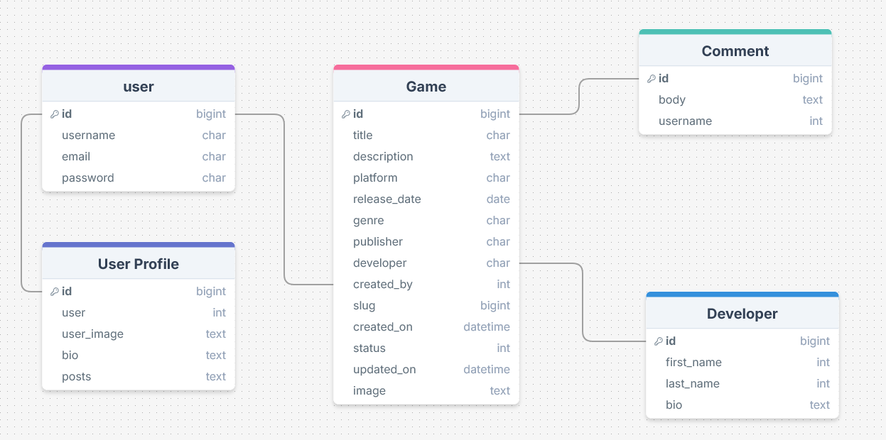

### **Colour Scheme**
After researching various options for this project, I opted for the colour scheme below:
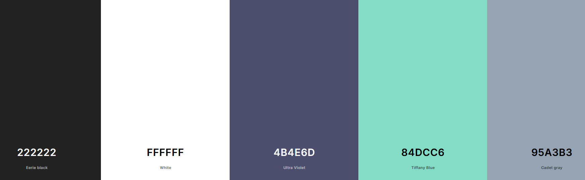

I did not end up using all of the colours because i believe the site looks a lot more cleaner with a few less colours.

#### **Typography**

I researched a few different fonts that I thought would fit the sites theme. I eventually decided on:

*[Roboto](https://fonts.google.com/specimen/Roboto)
I chose Roboto for its simplicity so the site is readible, also the font reminds of my text you see in Video Games which fits perfectly for the site.

​

## Agile Development

I used Github projects to create and track issues and User Stories. The Agile processes and methodologies can be viewed [here](/AGILE.md)

 

 

# **Features**

## **Site Navigation**

### **Admin Page**

The Admin Page was setup right at the start of the project as it is crucial to provide the site with test data and users to the project.

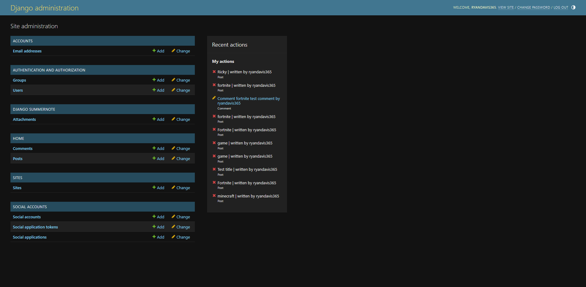

### **Navbar**
​
The Navbar is a bootstrap component which allows users to navigate around the site with ease. 

When the user is logged out they are unable to create a post. Upon clicking the "Create Post" option on the navbar the user will be told to "Log in to create a post."

The Navbar has been edited to display properly on smaller screens using bootstrap:

iPhone:

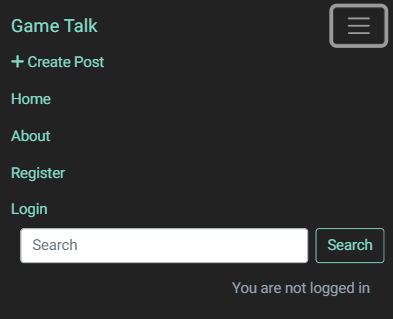

iPad:

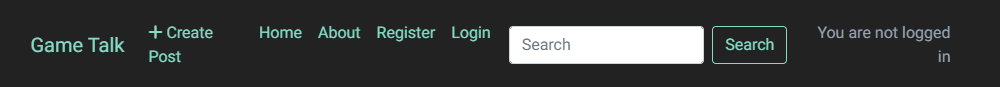

### Social Media Links

The social media icons are situated at the bottom of the page on the Footer. The Social Media links are functional and will open in a new tab. 
**NOTE:** There is no actual Social Media Content for this site at the time of writing.

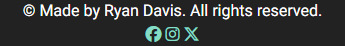

### **Home Page**

The Home Page uses a background image that shows people playing games on computers, this was chosen due to its relevance to the site. The home page is where the paginated list of
video game posts created by the users of the site or an admin will be displayed. Each video game post is a card displaying the image they provided for the game, the title, the beginning of the description, when it was created and the user it was created by. If the user who created the post does not provide an image there is a default image that will appear which says "No image available"

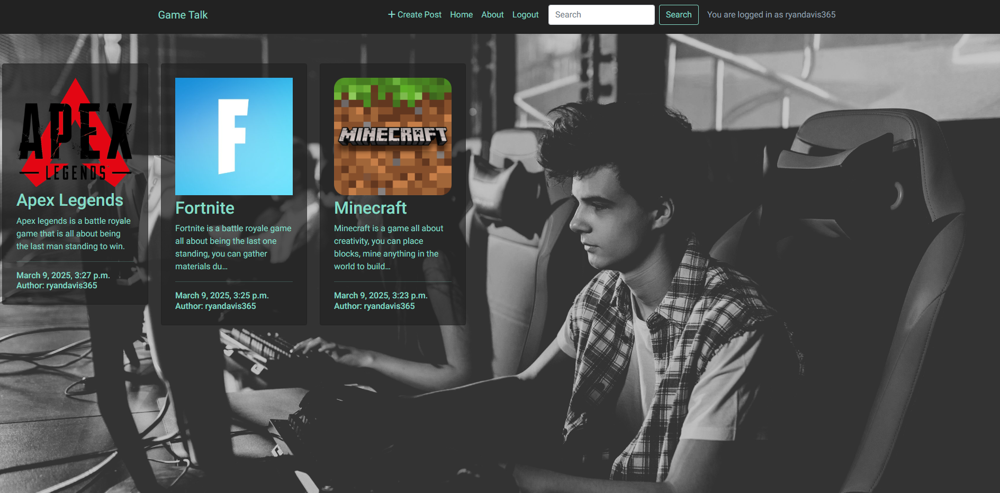

The Home Page is responsive and works well on any device. The user can search for games using the search box on the navbar. This is how it looks on an iPhone:

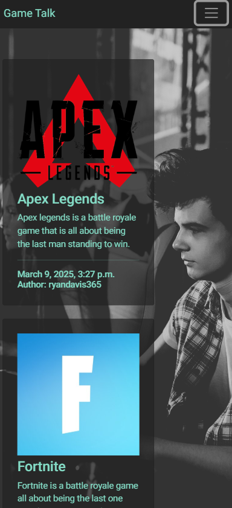

and an Ipad:

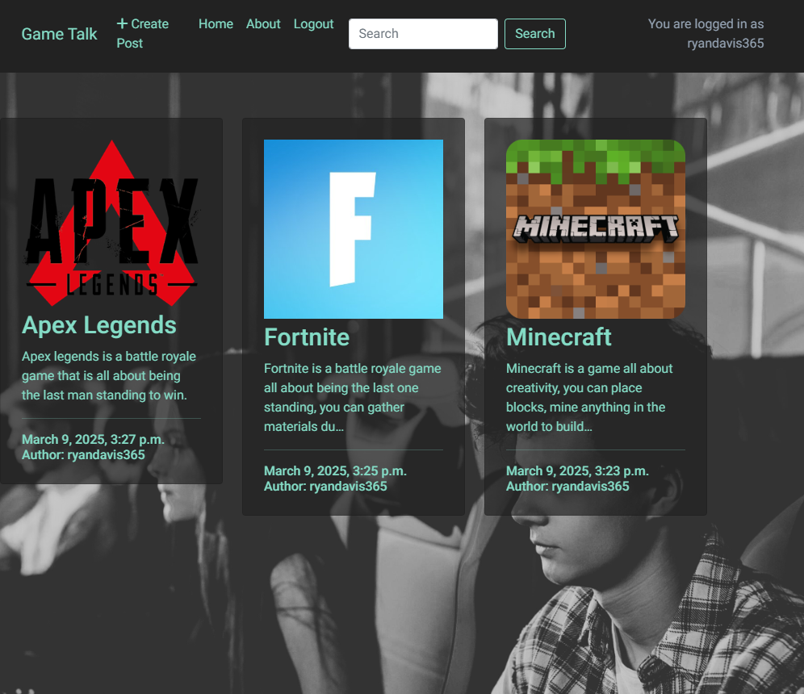

### **About Page**

The About Page explains the benefits of users registering an account and getting involved with the website, wether that be by creating posts themselfs or commenting on other users posts and getting involved in the discussion.

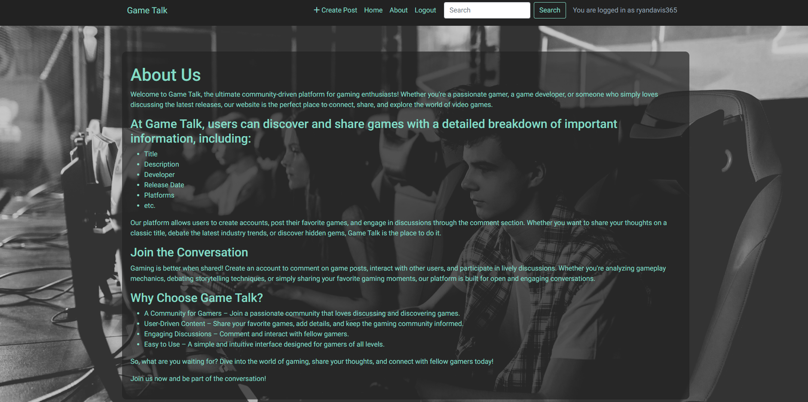

### **Create Post Page** 

If the user who selects the "Create Post" page is not logged in they will be presented with "Log in to create a post."

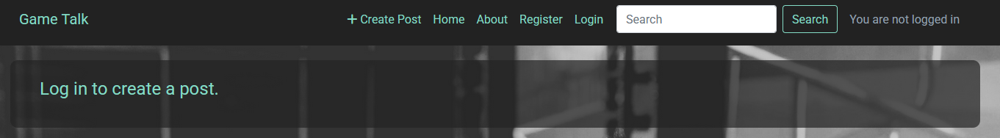

If the user who selects the "Create Post" page is logged in they will be presented with a form with multiple different sections that the user can fill out to create a post.

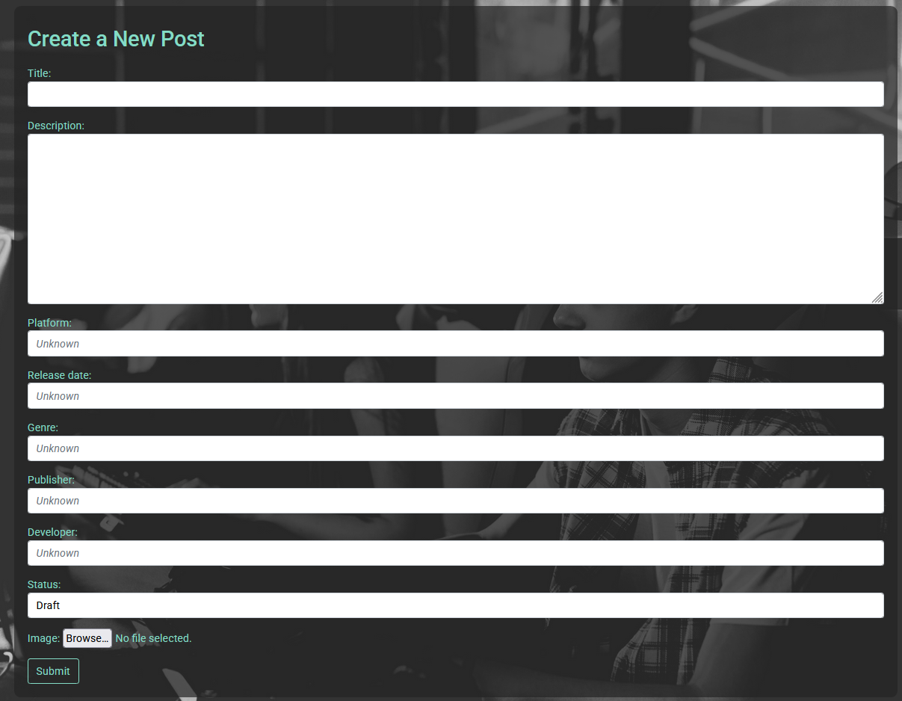

### **Game Page**

Once the user clicks on a post from the home page they will be navigated to the post they selected and shown all the details that the user who created the post entered. Along with the date and time the post was made and the name of the user who created it.

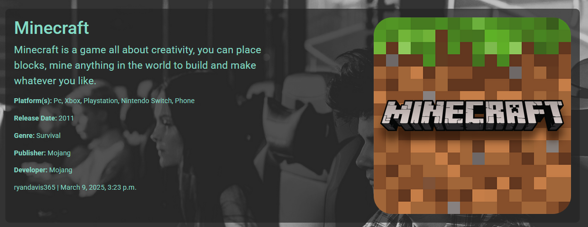

If the user scrolls down the page they will see the Comment section that registered users can use to post comments, delete their own comments or edit them.

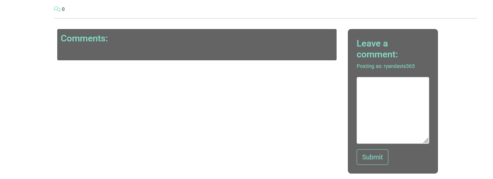

### **Allauth Account Pages**

All account pages use the same background as the home and about page to match the theme of the website.

#### Sign Up

I used allauth to handle the account pages for the project. In order to register, the User must complete the form on the Signup Page which they get navigated to by clicking Register on the Nav Bar.

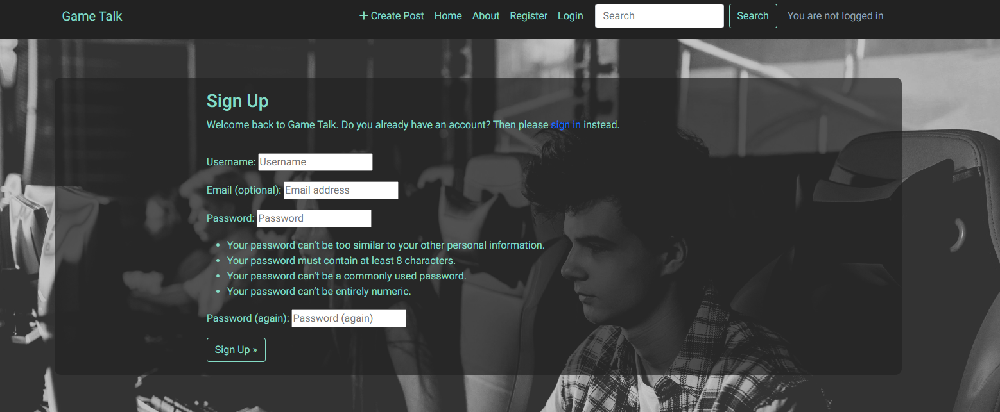

Phone:

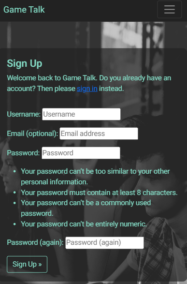

Once the user has successfully registered, they will be logged in and taken to the Home Page. The form will display error messages in several circumstances:

* The user chooses a Username that is already taken
* The password is not long enough
* The passwords do not match

#### Log In

Existing Users can log in by clicking the Log In button on the Nav Bar. This will bring them to the Log In Page:

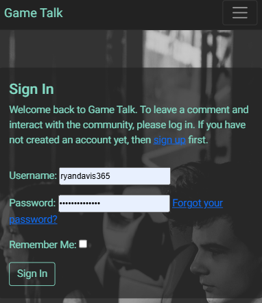

If the log in details are not valid an error message will be displayed.

Phone:

#### Log Out

To log out of the site and end the current session, the User can navigate to Logout in the Nav Bar.

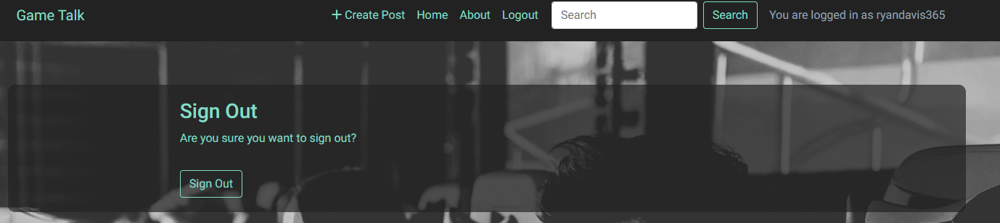

The user can confirm by clicking the "Sign Out" button or cancel by going back to another page. If the user chooses to log out, they are redirected to the Home Page and a success message informs them they have been logged out:

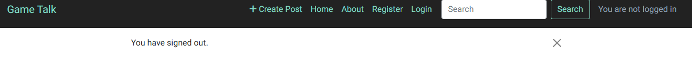

## Messages

User feedback is provided by success messages with the aim of providing a more involved User Experience. These messages are dismissible by clicking the 'X':

**Successful Login**

**Successful add Game Post message**

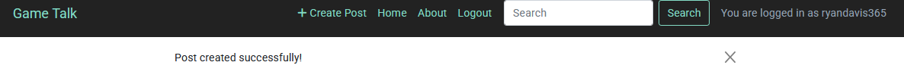

**Successful Comment Submission**

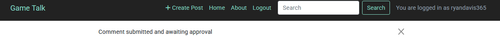

**Successful Comment Deletion**

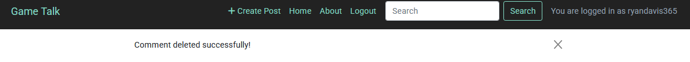

## Defensive Design

In order to avoid the user unintentionally deleting their own content, some simple defensive design programming was implemented. If a User is logged in and clicks delete on one of their reviews, they will be prompted for confirmation:

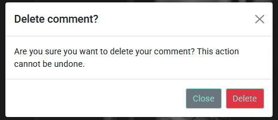

## **Future-Enhancements**

There are a number of areas with scope for future improvement. This project has been challenging and ultimately the project deadline was fast approaching. There is potential to add the following:

* The ability to view Users profiles and all the posts they have created.
* The ability for Users to comment on other Users profiles to beging discussions with them.
* The ability for users to be able to delete or edit their own posts.

## **Testing Phase**

The testing process, along with bugs, can be viewed [here](/TESTING.md)

