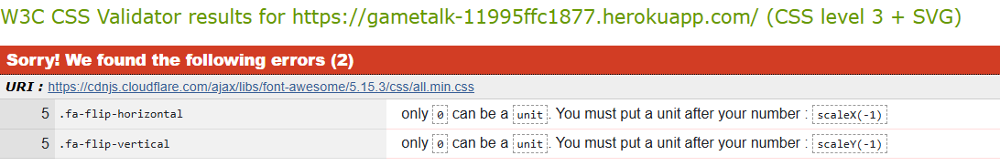

# Testing Page Table of Contents
* [**During Development Testing**](#during-development-testing)
    * [*Manual Testing*](#manual-testing)
    * [*Bugs and Fixes*](#bugs-and-fixes)
* [**Post Development Testing**](#post-development-testing)
    * [**Validators**](#validators)
        * [*HTML*](#html---httpsvalidatorw3orgnu)
        * [*CSS*](#css---httpsjigsaww3orgcss-validator)
  * [**Lighthouse Scores**](#lighthouse-scores)
      * [*Desktop Version:*](#desktop-version)
      * [*Mobile Version*](#mobile-version)

## **During Development Testing**
During the development process, I was manually testing in the following ways:

1. Manually testing each element for appearance and responsiveness by running the webpage via a port on Visual Studio Code.
    
1. Published the page via Heroku and made sure everything was working well on the officially deployed page.

### ***Manual Testing:***
* During testing, I used three different browsers to ensure cross-compatibility. The desktop browsers used by myself were:

    1. Chrome
    2. FireFox
    3. Edge

* I then used the devtools to simulate different screen sizes/devices.
* I also tested them on the devices i own like an iPhone and an iPad.

### ***Bugs and Fixes:***

Below is a list of bugs I found during the development process by testing myself via the website i ported on Visual Studio Code. I tried each element for how the browser would display the page to potential users on a range of different screen sizes.

1. **Intended Outcome** - A background image to span the entire width of the page and be fully responsive across all screen sizes.
    * ***Issue Found:*** 
        * Image was only displaying as a box on the center of the screen.
    * ***Solution Used:*** 
        * I created another div above the container div and put the "background" class in there.

1. **Intended Outcome** - When trying to style the image the user provides with a post i couldnt get it where i wanted.
    * ***Issue Found:***
        * Image was being awkwardly placed in the middle of the post on the post_detail.html
    * ***Solution Used:***
        * I used CSS Flex to make it fit on the screen in the correct position.

1. **Intended Outcome** - All text to be easily readable.
    * ***Issue Found:***
        * Sometimes the text wouldnt stand out enough to read it easily with the background image.
    * ***Solution Used:***
        * Used CSS to add a background to the text so it stood out more for readability.

1. **Intended Outcome** - Images able to be viewed on the deployed website with Heroku.
    * ***Issue Found:***
        * The images would not load.
    * ***Solution Used:***
        * I installed the package "Whitenoise".

1. **Intended Outcome** - Images able to be viewed on the deployed website with Heroku.
    * ***Issue Found:***
        * The images would not load.
    * ***Solution Used:***
        * I had errors with the different folder names such as "staticfiles", "static" and "media" and setting up where the images provided by users would be sent to.

## **Post Development Testing**
### **Validators**

#### ***HTML*** - https://validator.w3.org/nu/

I inputed all code into the Validator individually and only errors i recieved were space errors due to using "".

#### ***CSS*** - https://jigsaw.w3.org/css-validator/

* All pages tested, no issues found via URL or file upload.\

### **Lighthouse Scores**
### **Test conditions**
* I did all lighthouse tests on every page on the website.
* I ran the tests for both mobile and desktop.
#### ***Desktop Version***
I have only included one screenshot for desktop as all pages were roughly the same score. The only thing changing was the "performance" due to images being load on the page.

#### ***Mobile Version***
I have only included one screenshot again due to the same reason as the desktop pages.

***
[Return to README.md](README.md)