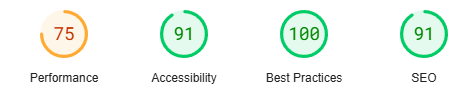

# Testing Page Table of Contents
* [**During Development Testing**](#during-development-testing)
    * [*Manual Testing*](#manual-testing)
    * [*Bugs and Fixes*](#bugs-and-fixes)
* [**Post Development Testing**](#post-development-testing)
    * [**Validators**](#validators)
        * [*HTML*](#html---httpsvalidatorw3orgnu)
        * [*CSS*](#css---httpsjigsaww3orgcss-validator)
        * [*JavaScript*](#javascript)
  * [**Lighthouse Scores**](#lighthouse-scores)
      * [*Desktop Version:*](#desktop-version)
      * [*Mobile Version*](#mobile-version)

## **During Development Testing**
During the development process, I was manually testing in the following ways:

1. Manually testing each element for appearance and responsiveness by running the webpage via a port on Visual Studio Code.
    
1. Published the page via Heroku and made sure everything was working well on the officially deployed page.

### ***Manual Testing:***
* During testing, I used three different browsers to ensure cross-compatibility. The desktop browsers used by myself were:

    1. Chrome
    2. FireFox
    3. Edge

* I then used the devtools to simulate different screen sizes/devices.
* I also tested them on the devices i own like an iPhone and an iPad.

### **Manual Testing of User Stories**

#### **EPIC 1 - Set up and Deployment:**

Most of this epic were tasks for the development phase; therefore, the testing is the working of the overall site. Below is the one story that tested all tasks as one.

|passed | **Access a live url** so that I can **use the site on any device**.
|:---:|:---|
|&check;| Can access the site via the deployed URL on the desktop.
|&check;| Can access the site via the deployed URL on mobile.
|&check;| Can access the site via the deployed URL on a tablet.
|&check;| All images and styles are tacked and as expected.

#### **EPIC 2 - Viewing and Navigation:**

|passed | .**Read about the site** so that I can **understand the sites purpose.**
|:---:|:---|
|&check;| The site has a clear purpose and is easy to navigate.

|passed | **View paginated list of posts** so that I can **select which post I want to view.**
|:---:|:---|
|&check;| The site has a list of products.
|&check;| The list of products is paginated.
|&check;| The post list is ordered by default by ID.

|passed | **View individual posts** so that I can **select a post in particular i want to read.**
|:---:|:---|
|&check;| The site has a individual post page.
|&check;| The individual post page shows the post image.
|&check;| The individual post page shows the post name.
|&check;| The individual post page shows the post description and details.
|&check;| The individual post page shows the post author and time/date created.
|&check;| The individual post page shows the posts comments.

#### **EPIC 3 - Sorting and Searching:**

|passed | **Search for a post by name** so that I can **find a specific post I'd like to view.**
|:---:|:---|
|&check;| Search bar is visible on all pages.
|&check;| Search returns results based on the search term.
|&check;| Search query matches product name.

#### **EPIC 4 - Registration and User Accounts:**

|passed | **Register an account** so that I can **create a post, edit/delete my own posts and comment on a post.**
|:---:|:---|
|&check;| The site has a registration page.
|&check;| Users can not register with an email address that is already in use.
|&check;| Users can successfully register for the site
|&check;| Users can not register with a username that is already in use.
|&check;| Users can not register with a password similar to their user name.
|&check;| Users can not register with a password similar to their email address.
|&check;| Users can not register with a too short password.
|&check;| Errors are displayed to the user if any of the above are attempted.
|&check;| Success message is displayed to the user if registration is successful.

|passed | **View my profile** so that I can **edit or delete posts.**
|:---:|:---|
|&check;| Users can view their profile to view their posts.
|&check;| Users can select a post and edit it.
|&check;| Users can select a post and delete it.

#### **EPIC 5 - Posts**

|passed | **Create a post** so that I can **make my post accessible for other users.**
|:---:|:---|
|&check;| Users can create a post once they are logged in.

|passed | **Comment on a post** so that I can **be involved in the discussion.**
|:---:|:---|
|&check;| Users can leave a comment on another users post, or their own.

|passed | **Modify or delete a comment on a post** so that I can **update my public opinion should it ever change.**
|:---:|:---|
|&check;| Users can edit their own comments on a post.
|&check;| Users can delete their own comments on a post.

|passed | **View comments** so that I can **view comments on an individual post so that I can read the conversation.**
|:---:|:---|
|&check;| Users can view all comments left by users on all posts.

#### **EPIC 6 - Admin and Site Management**

|passed | **Manage Posts** so that I can **create, read, update and delete posts so that I can manage the sites content.**
|:---:|:---|
|&check;| Posts can be managed by an admin via the admin panel to ensure all site content is okay to be on the site.

### ***Bugs and Fixes:***

Below is a list of bugs I found during the development process by testing myself via the website i ported on Visual Studio Code. I tried each element for how the browser would display the page to potential users on a range of different screen sizes.

1. **Intended Outcome** - A background image to span the entire width of the page and be fully responsive across all screen sizes.
    * ***Issue Found:*** 
        * Image was only displaying as a box on the center of the screen.
    * ***Solution Used:*** 
        * I created another div above the container div and put the "background" class in there.

1. **Intended Outcome** - When trying to style the image the user provides with a post i couldnt get it where i wanted.
    * ***Issue Found:***
        * Image was being awkwardly placed in the middle of the post on the post_detail.html
    * ***Solution Used:***
        * I used CSS Flex to make it fit on the screen in the correct position.

1. **Intended Outcome** - All text to be easily readable.
    * ***Issue Found:***
        * Sometimes the text wouldnt stand out enough to read it easily with the background image.
    * ***Solution Used:***
        * Used CSS to add a background to the text so it stood out more for readability.

1. **Intended Outcome** - Images able to be viewed on the deployed website with Heroku.
    * ***Issue Found:***
        * The images would not load.
    * ***Solution Used:***
        * I installed the package "Whitenoise".

1. **Intended Outcome** - Images able to be viewed on the deployed website with Heroku.
    * ***Issue Found:***
        * The images would not load.
    * ***Solution Used:***
        * I had errors with the different folder names such as "staticfiles", "static" and "media" and setting up where the images provided by users would be sent to.

1. **Intended Outcome** - Favicon's to load on all pages.
    * ***Issue Found:***
        * The Favicon would only load on the home page.
    * ***Solution Used:***
        * I was using "" before but i removed it and went with the more simpler method of just referencing the favicon image from my "images" folder.

## **Post Development Testing**
### **Validators**

#### ***HTML*** - https://validator.w3.org/nu/

I inputed all code into the Validator individually and only errors i recieved were space errors due to using "".

#### ***CSS*** - https://jigsaw.w3.org/css-validator/

* All pages tested, no issues found via URL or file upload.

The only 2 errors i have are related to Font Awesome and there is nothing i can do about it.

## **Lighthouse Scores**
### **Test conditions**
* I did all lighthouse tests on every page on the website.
* I ran the tests for both mobile and desktop.
#### ***Desktop Version***
I have only included one screenshot for desktop as all pages were roughly the same score. The only thing changing was the "performance" due to images being load on the page.

#### ***Mobile Version***
I have only included one screenshot again due to the same reason as the desktop pages.

During this project confidential information was posted to GitHub due to me having an error with visual studio code and my files not saving to my pc for a reason that i do not know why.
Because this happened i regenerated a new Secret Key and put all sensitive information back into env.py

[Return to README.md](README.md)

